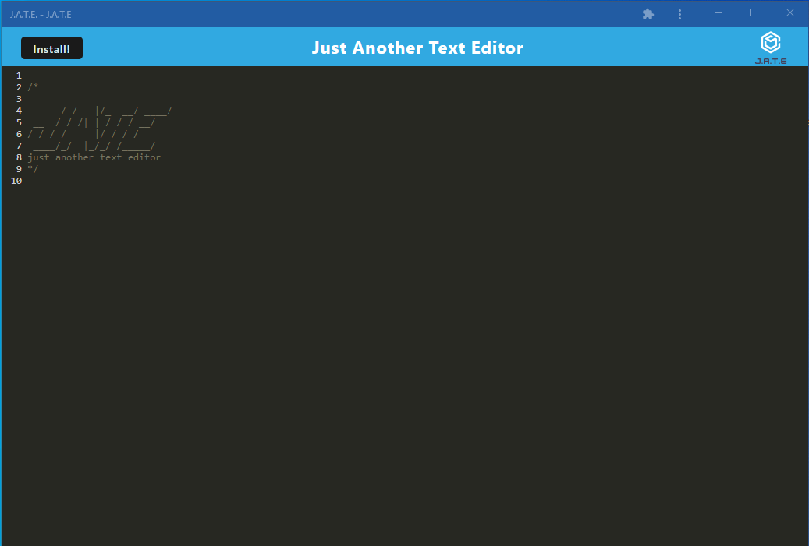

# Module 19 Challenge: Just Another Text Editor

## Description

Just Another Text Editor.

Simple text editor that allows the user to return to typed input when clicking off of the window, refreshing the page, or closing the window. Allows the user to install the application for offline use.

## Table of Contents
- [Installation](#installation)
- [Usage](#usage)
- [License](#license)
- [Screenshot](#screenshot)
- [Contributing](#contributing)
- [Tests](#tests)
- [Questions](#questions)

## Installation

Open the below Heroku link to the project and click the install button (top left). This will allow you to be able to use the application offline.

## Usage

Access the application via the deployed Heroku link. The application allows the user to click off of the window, the application will save the text in the editor and allow the user to come back to the text after clicking off or closing the window.

## License

This project uses the MIT license.

## Screenshot

## Contributing

Helpful e-mails or tips to make this project work better are ALWAYS appreciated. Even helpful criticism would be warmly welcomed. Special shoutout to my classmates, TA, and instructor for making this project achievable. Also a huge thank you to my tutors, dozens of docs read, videos watched and all who have help make this project understandable and make the logic and reasoning digestable. 

## Tests

No tests written for this project.

## Questions

Link to deployed Heroku application: https://anothertexteditor19.herokuapp.com/

Any further questions e-mail me: nate.k.long@gmail.com

Check out my other projects: https://www.github.com/Tunestring